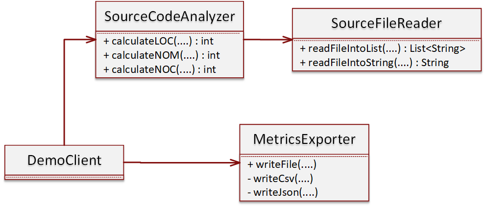

# A "Smelly" source code analyzer
// TODO: Intro

## Module design
The follwoing class diagram visualizes the classes and relatioships of the "smelly" source code analyzer. 


## Execute the module
```
java –jar “jar-with-dependencies” arg0 arg1 arg2 arg3 arg4

  arg0 = “JavaSourceCodeInputFile” (e.g., src/test/resources/TestClass.java)
  arg1 = “sourceCodeAnalyzerType” [regex|strcomp]
  arg2 = “SourceCodeLocationType” [local|web]
  arg3 = “OutputFilePath” (e.g., ../output_metrics_file)
  arg4 = “OutputFileType” [csv|json]
```
example: 
```
java –jar ./target/sourcecodeanalyzer-0.0.1-SNAPSHOT-jar-with-dependencies.jar ./src/test/resources/TestClass.java regex local metrics_results csv
```
