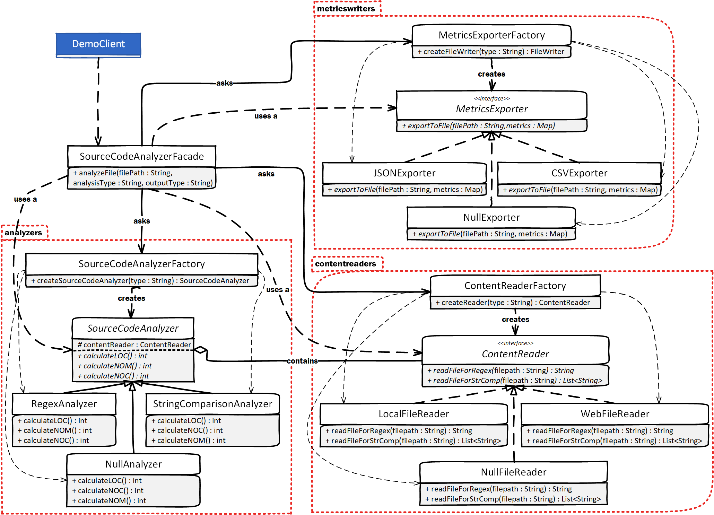

# Refactored source code analyzer
This is the refatcored version of the Source Code Analyzer system. The follwoing sections present the Class Diagram of the system and the design patterns used in order to satisfy specific design desicions and requirements.  

## Module design
The following class diagram visualizes the refactored source code analyzer. The red doted rectangles represent ```packages``` that group classes that handle similar concepts. For example ```analyzer``` package consists of the _Analyzer_ interface ```SourceCodeAnalyzer```, its implementations (```RegexAnalyzer, StringComparisonAnalyzer, NullAnalyzer```) and the class responsible for creating the implementations (```SourceCodeAnalyzerFactory```). 
_Note that some methods (e.g., getters and setters) are not included in the class diargam_


### Design Desicions
All design decisions that led to the current design were taken to satisfy the follwoing requirements: 
1. The system should be __extendable__ in the three dimensions (SourceAnalyzers, MetricsExporters and ContentReaders).
2. Minimize changes to other dimensions when extending (or modifying) one of the three dimensions.
3. Reduce complexity and code duplication withing the classes.
4. Make the system reusable by diffrent Clients (minimize coupling with Client).

### Patterns used
The following sub-sections presents the design patterns used in order to satisfy the aforementioned requirements. 

__Important__ There are more than one solutions that can be applied in order to improve the quality of the system. This is just one proposed solution that makes use of the design patterns presented in the SEiP class. 

#### Facade
The ```SourceCodeAnalyzerFacade``` entity was introduced in the design as a _Facade_ of our source code analyzer system. All object instantiations and calls have been moved from the ```Client``` to the ```SourceCodeAnalyzerFacade```. The application of this pattern has the following benefits(+) and implications(-) to our system:
- (+) We removed all coupling between the system and the Client (apart from the Facade). The system can now change minimazing any effect to the Client.  
- (+) Different methods (or even different Facades) can be added to the system in order to provide alternative functionalities to the Client.
- (-) We did not reduce the overall complexity of the system, just delegated the complexity from the Client to the Facade. Moreover, we added extra code to the system (one more class) that need to be maintained.
- (-) Facade is difficult to test with ordinary unit-tests due to many (non-injectable) dependencies. 

#### Strategy
For each dimension (SourceAnalyzers, MetricsExporters, ContentReaders) a _Strategy_ pattern was applied. In each case we introduced an interface (or an abstraction in the case of ```SourceCodeAnalyzer```) that describes the functionalities that the concrete classes should implement. The application of this pattern has the following benefits(+) and implications(-) to our system:
- (+) Each dimension can be extended independently without affecting other parts of the system.
- (+) Concrete objects, such as, ```CVSExporter``` and ```JSONExporter``` are now interchangeable.
- (+) Reduced code complexity and code duplication within classes (got rid of most repeatable ```if-else``` statements).
- (-) Introduced several more classes in the system. 
- (-) Concrete objects are bound to the functionality the their interfaces offer.

#### Null Object
In each _Strategy_ pattern we introduced a _Null Object_ that defines what will happen when a concrete class not specified and implemented was requested to perform a functionality. In all cases, the _Null Object_ implementations are throwing "user friendly" Exceptions and not NullPointerExceptions that require tracing. The application of this pattern has the following benefits(+) and implications(-) to our system:
- (+) A Client (or any other class) is no longer responsible for checking for null reference before referencing (e.g., call a method)
- (+) User can receive a specific error message that is a true indicator of the error occurred. 
- (-) If not handled well might hide the true reason of a caused error and thus, do more harm than good.

#### Factory
For each dimension (SourceAnalyzers, MetricsExporters, ContentReaders) and on top of each _Strategy_ pattern a _Simple Factory_ pattern was introduced. The classes ```SourceCodeAnalyzerFactory, ContentReaderFactory, MetricsExporterFactory``` are now responsible for creating and instantiating the concrete objects of each dimension. The application of this pattern has the follwoing benefits(+) and implications(-) to our system:
- (+) By hiding the creation details of concrete objects we reduce the coupling of other classes to the each dimension (module).
- (+) Each dimension can be extended without affecting other modules (apart from their corresponding Factory class).
- (-) We added some communication overhead to the system since a middle-man class is always called for creating an object.

#### Bridge
For the SourceAnalyzers and ContentReaders dimensions we used a _Bridge Pattern_ to describe their composition. Reading the content from a file is the responsiblity of an independent interface (and its implementations). Each Analyzer contains a ContentReader and delegates to that the functionality of reading the contents from a file. 
- (+) ContentReaders can be extended independently without changing any code in the Analyzers. 
- (+) Analyzers can be extended independently with minimum effect on the ContentReaders (addition of a corresponding method if needed). If we had a common Interface that described both Analyzers and ContentReaders we would have to create a new set of Analyzer-Reader for every new Analyzer or Reader added the system and thus, cause an exponential increase of subclasses. ([a more detailed example](https://refactoring.guru/design-patterns/bridge))
- (+) We can now switch ContentReaders without affecting the Analyzer that contains the Reader. 
- (-) Sometimes the functionality moved to the composed class contextually belong to the initital class, which breaks the cohesion of our system. (This does not apply on our case)

## Execute the module
The module builds in the same way the "smelly" module does. Any change in the code and the design should be unoticable to the end user!
