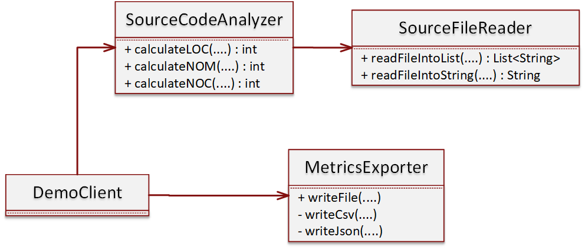

# A "Smelly" source code analyzer
This module presents a deliberately badly implemented source code analyzer. The code base suffers from:
- Code duplication
- Long and complex methods
- High coupling between the Client and the System
- High coupling between classes (classes directly use other concrete classes rather than their interfaces)

## Module design
The following class diagram visualizes the classes and relationships of the "smelly" source code analyzer.


## Build the module and the coverage report
```
mvn clean package jacoco:report
```

## Execute the module
```
java –jar “jar-with-dependencies” arg0 arg1 arg2 arg3 arg4

  arg0 = “JavaSourceCodeInputFile” (e.g., src/test/resources/TestClass.java)
  arg1 = “sourceCodeAnalyzerType” [regex|strcomp]
  arg2 = “SourceCodeLocationType” [local|web]
  arg3 = “OutputFilePath” (e.g., ../output_metrics_file)
  arg4 = “OutputFileType” [csv|json]
```
example:
```
java –jar ./target/sourcecodeanalyzer-0.0.1-SNAPSHOT-jar-with-dependencies.jar ./src/test/resources/TestClass.java regex local metrics_results csv
```
